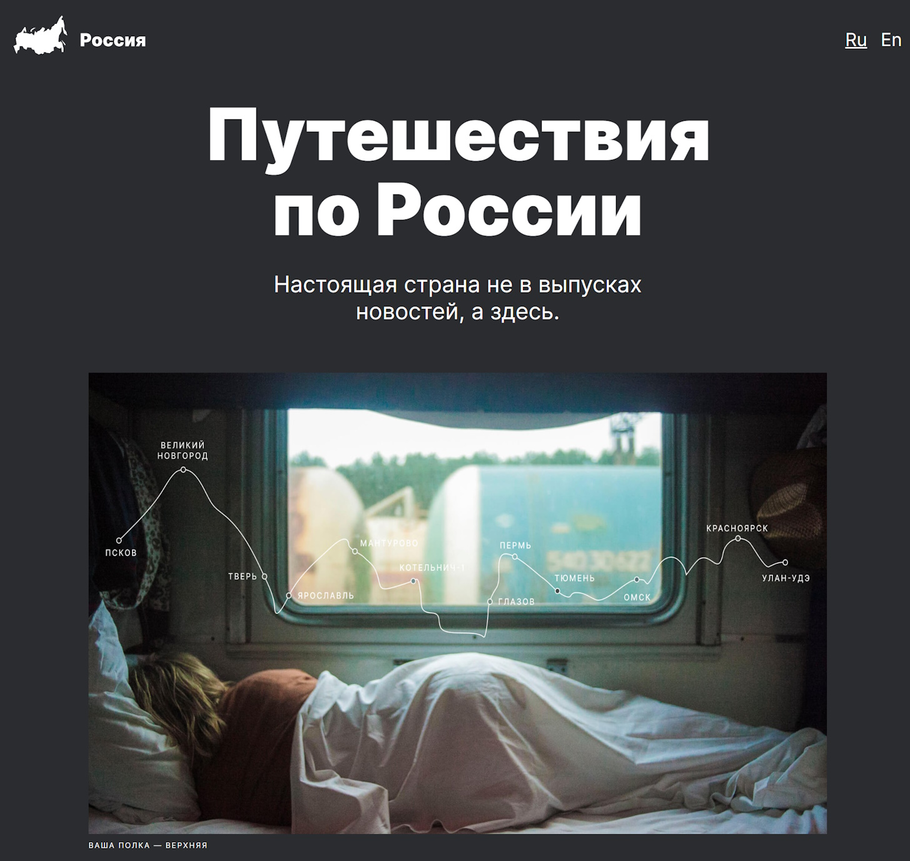

# 🚋 Путешествие по России 🚋

Информационный сайт о различных местах для путешествий по России, 
включающий описание достопримечательностей, галерею изображений и другую полезную информацию.
### Ссылки
[Готовый проект на gh-pages](https://gudrum1983.github.io/russian-travel/index.html) | [Макет в Figma](https://www.figma.com/file/5S2WSbEFL6awjVWJ0NWL8Q/Sprint-3_-Russia-_-desktop-mobile?node-id=28503%3A0)



## Структура проекта
- Основной сайт: [index.html](index.html)
- Стили: [pages/index.css](pages/index.css), [blocks/](blocks/)
- Шрифты: [vendor/fonts/](vendor/fonts/)
- Изображения: [images/](images/)

## Что сделала
- Создала адаптивный дизайн для различных устройств и экранов с использованием медиазапросов, Flex и Grid контейнеров.
- Использовала методологию BEM для организации CSS-кода.
- Подключила и настроила кастомные шрифты.
- Организовала файловую структуру проекта для удобства поддержки и расширения.
- Протестировала сайт на кроссбраузерную совместимость с использованием современных CSS-стандартов и медиазапросов.
- Оптимизировала производительность сайта, используя SVG-изображения и кастомные шрифты в форматах WOFF и WOFF2.
- Использовала относительные величины (%, vh, vw, fr) и выражения с `calc()` для гибкого управления размерами.
- Применяла семантические HTML-теги для улучшения доступности и SEO.
- Провела проверку на типографику, чтобы обеспечить читаемость и визуальную гармонию текста.

## Планы по доработке
- [x]  Добавление мультиязычности (возможность переключения языков на сайте).
- [ ]  Добавление анимации на главной картинке.
- [ ]  Улучшение интерактивных элементов с использованием JavaScript.

## Технологии и практики
`HTML` `CSS` `SEO` `Git` `Медиазапросы` `БЭМ` `Типографика`

## Инструкция по запуску
Чтобы запустить проект локально, нужно сделать несколько простых шагов:
1. Склонируйте этот репозиторий:
    ```bash
    git clone https://github.com/gudrum1983/russian-travel.git
    ```
2. Перейдите в папку проекта:
    ```bash
    cd russian-travel
    ```
3. Откройте файл `index.html` в вашем браузере.

## Системные требования
Для работы с проектом потребуется любой современный браузер.

----------
###### Второй проект на Я.Практикум - Кочкина Екатерина
